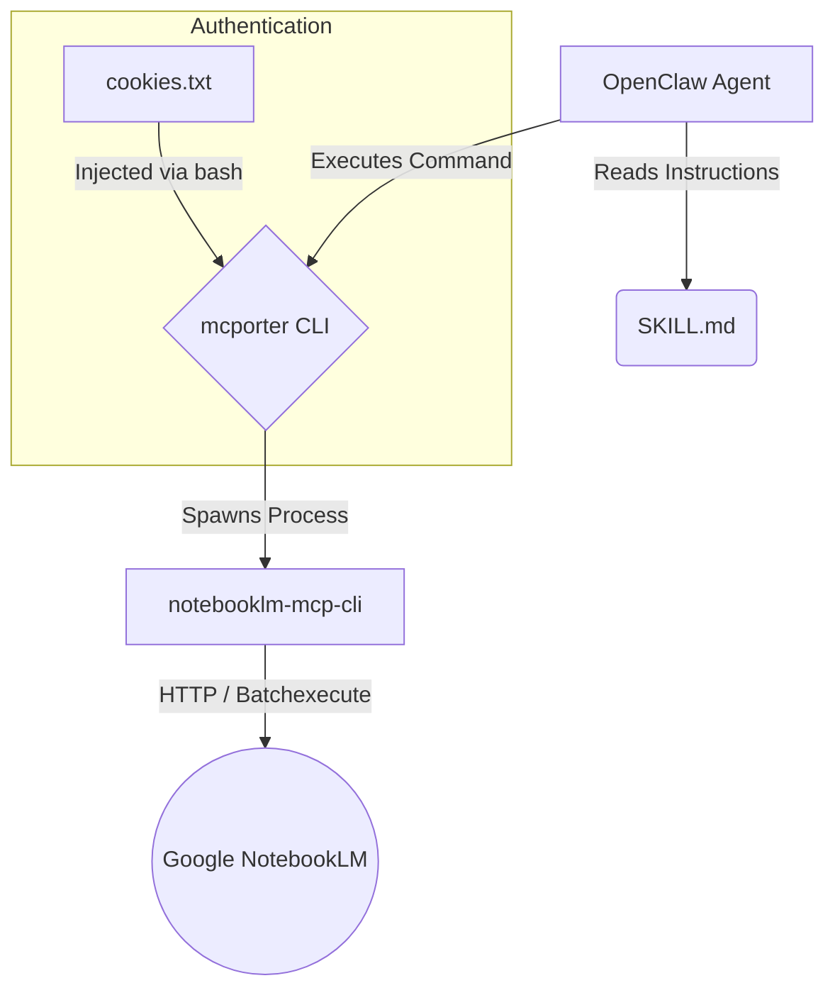

# OpenClaw NotebookLM Skill Architecture

This document provides a deep dive into how the NotebookLM Skill integrates with OpenClaw.

## 1. High-Level Architecture

The integration follows a **multi-layered architecture** bridging the OpenClaw Agent with Google's NotebookLM internal APIs.



### Components

1.  **OpenClaw Agent**: The AI agent executing the task. It "learns" how to use NotebookLM by reading `SKILL.md`.
2.  **SKILL.md**: The interface definition. It acts as both a **Package Manifest** (telling OpenClaw what to install) and a **System Prompt** (telling the Agent how to construct commands).
3.  **mcporter**: OpenClaw's universal MCP client. It acts as the "bridge" or "gateway". It manages the lifecycle of the MCP server and translates CLI commands into JSON-RPC messages.
4.  **notebooklm-mcp-cli**: The Python-based MCP Server. It implements the Model Context Protocol (MCP) over Stdio, handling the actual logic of parsing requests and communicating with Google.

## 2. SKILL.md Breakdown

The `SKILL.md` file is the heart of the integration.

### Metadata (Frontmatter)
Lines 1-30 contain YAML metadata used by OpenClaw's automatic skill loader.

```yaml
metadata:
  openclaw:
    requires: { bins: ["notebooklm-mcp"] }  # Dependency check
    install:                                # Auto-installation recipes
      - id: uv
        package: notebooklm-mcp-cli
```

*   **`requires`**: Ensures the binary exists before the skill is considered "ready".
*   **`install`**: Instructions for OpenClaw to install the underlying Python package via `uv` or `pip`.

### Prompt Engineering (Markdown Content)
The rest of the file is **Markdown** that gets injected into the Agent's context.

*   **Description**: Tells the Agent *what* this tool is for ("Manage notebooks, query sources...").
*   **Capabilities & Examples**: This is crucial. It provides **Few-Shot Prompting**. By showing the Agent specific `mcporter call` commands, we teach it the exact syntax required to invoke `notebook_create` or `notebook_query` without hallucinations.

## 3. Data Flow & Transport

### JSON-RPC over Stdio

Communication between `mcporter` and `notebooklm-mcp` happens via **Standard Input/Output (Stdio)**.

1.  **Request**: `mcporter` sends a JSON-RPC 2.0 request to `stdin` of the Python process.
    ```json
    {"jsonrpc": "2.0", "method": "tools/call", "params": {"name": "notebook_list", ...}}
    ```
2.  **Processing**: The Python server receives this, executes the function, and calls Google APIs.
3.  **Response**: The Python server prints the JSON-RPC response to `stdout`.
    ```json
    {"jsonrpc": "2.0", "result": {...}}
    ```

### Configuration (The `bash -c` Wrapper)

Because MCP servers over Stdio inherit the environment of the parent process, and OpenClaw agents might run in restricted environments, we use a **wrapper strategy** for authentication.

```bash
bash -c 'export NOTEBOOKLM_COOKIES=$(cat ~/.nlm/cookies.txt); notebooklm-mcp --transport stdio'
```

*   **Why?**: `export` inside `bash -c` ensures the environment variable is set *only* for that process tree.
*   **File Read**: `$(cat ...)` reads the cookies at *runtime*. This means if you update `cookies.txt` (via `nlm login --manual`), the *next* request automatically uses the new cookies without restarting the agent daemon.

## 4. Authentication Mechanism

Google NotebookLM does not have a public API. We use reverse-engineered internal APIs (`batchexecute`).

*   **Cookies**: We rely on the `__Secure-1PSID` and `__Secure-3PSID` cookies from an authenticated browser session.
*   **Refresh**: The `notebooklm-mcp` server attempts to refresh expired tokens using the `SID` cookie if possible, but manual extraction is the fallback.

## 5. Security & Isolation

*   This integration runs entirely on the **User's Host Machine** (or Server).
*   Credentials (`cookies.txt`) are stored locally in the user's home directory.
*   Traffic goes directly from the local machine to `notebooklm.google.com`. OpenClaw cloud does not proxy these requests.
